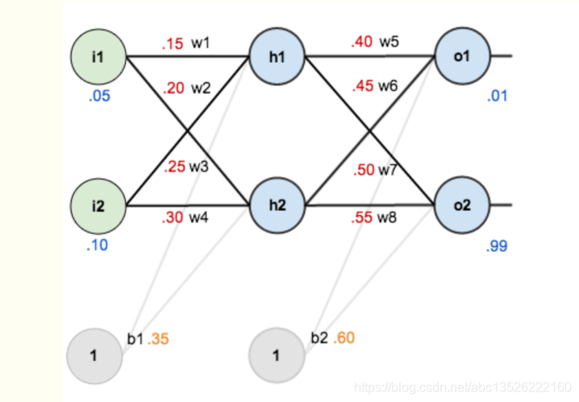

Week 3 Homework
--

**Go through and run [Keras MNIST Tutorial](https://keras.io/examples/vision/mnist_convnet/), read and understand each line of code, and push your exercise code to the Github repository**

Set up the Python environment with the below commands:

~~~shell
# Activate the virtual environment
.\venv\Scripts\activate

# Install the requirements
pip install -r requirements-not-required.txt

# (Optional) Export the first-layer requirements
pip list --not-required --format freeze > requirements-not-required-only.txt
~~~

After setting up the environment above, run the program with the below steps:

~~~shell
# Run the python script
python.exe .\simple-mnist-convnet.py
~~~

Week 4 Homework
--

**1. Go through and run [Pytorch MNIST Example](https://github.com/pytorch/examples/blob/master/mnist/main.py), read and understand each line of code (google it if not understand), fork the code, run and debug step through each line of the code via PyCharm, push your code and step-in screenshot to the Github repository**

```shell
# Run the python script
python.exe .\pytorch-mnist.py
```

Also, see the attached [screenshot](./pytorch-mnist.py.screenshot.txt).

**2. Implement the following network (with i1=0.05, i2=0.1, b1=0.35, o1=0.01, o2=0.99) and the training loop by [PyTorch Autograd in a similar way as this slide](https://docs.google.com/presentation/d/1wn6UONkzJTTA3XxSgzS1hmkFONoVt2X8TO-VFU6Uo-E/edit#slide=id.g9f8093ad43_0_429) and show the output screenshot in README (2 marks):**


```shell
# Run the python script
python.exe .\pytorch-auto-encoder.py

# Sample code from https://blog.csdn.net/abc13526222160/article/details/83817638
python.exe .\auto-encoder.py
```

Also, we tentatively tuned the model to complete training within 3000 porches; see the attached [screenshot](./pytorch-auto-encoder.py.screenshot.txt).
